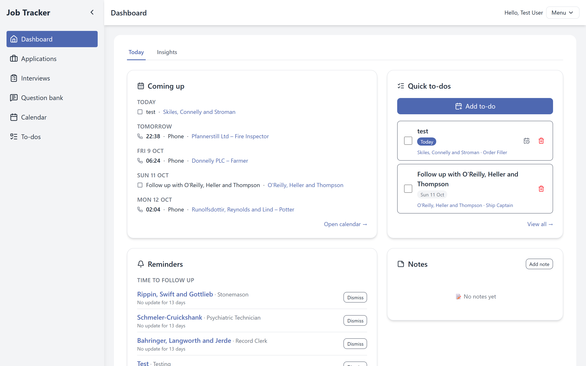

# Job Tracker

A full-stack app for running a job search: every application, interview, follow-up and document in one place, with prep pages for interviews and a daily reminder email.



---

## ✨ Features

**Applications**
- Track company, position, status, priority, location, link, notes and applied date.
- Grid view or grouped by date, with status, priority and tag filters.
- Coloured tags, managed from one dialog.
- Select mode for batch edits: give different applications different status and tag changes, preview them on the cards, and save them all at once. Batch archive and restore.
- Archive with a choice of what happens to the open to-dos. Excel import and export.

**Interviews and prep**
- Upcoming, past and all interviews, with search, a grouped view and batch delete.
- A prep page for each interview: a checklist built from your own template (with items per interview type), the people you'll meet, questions to ask, and a debrief with a rating. It saves as you type.
- **Question bank:** prepared answers by category, linked into any interview with a per-interview note.

**Staying on top of it**
- **Dashboard:** a *Today* tab (coming up, reminders, quick to-dos, notes) and an *Insights* tab (goals, charts).
- **To-dos** with due dates, optionally linked to an application, plus quick follow-up shortcuts.
- **Reminders** for applications with no update for a set number of days and for due to-dos: in the app and/or as a daily 08:00 email.
- **Calendar** of interviews and to-dos.
- **Documents:** CVs, cover letters and portfolio or LinkedIn links, attached to the applications you sent them with.

**Account and app**
- Landing page for visitors, with a one-click demo login.
- Settings: goals, reminders, the archive to-dos rule, the prep checklist template, email, password, and account deletion.
- Light and dark mode, and it works at phone width.

---

## 🛠️ Tech stack

| | |
|---|---|
| **Backend** | Laravel 12 · PHP 8.4 · MySQL · Laravel Sanctum (SPA cookie sessions) · Maatwebsite Excel |
| **Frontend** | React 19 · React Router 7 · Vite · Tailwind CSS v4 · zustand · Axios · date-fns · ECharts · lucide-react |
| **Quality** | PHPUnit (260+ feature tests) · Laravel Pint · ESLint |

### How it's put together

- **API:** a JSON API under `/api`. Controllers stay thin: validation lives in Form Requests, multi-step logic in `app/Services`, and responses go through API Resources.
- **Ownership:** every record belongs to a user. Single-record routes use policies (`app/Policies`) that answer 404 for someone else's data, and lists are always queried through the logged-in user.
- **Enums:** statuses, priorities, interview types, document kinds and the other fixed value sets are PHP enums (`app/Enums`), used in casts, validation and queries.
- **All-or-nothing batch endpoints:** batch changes, archive or restore, and interview delete run in a transaction, and any id that isn't yours means a 404 with nothing changed.
- **Frontend structure:** pages are in `src/views`, shared pieces in `src/components/UI`, fixed values in `src/constants`, and app-wide state (auth, theme, toasts, confirm dialogs) in zustand stores.

---

## 📦 Project structure

```
job-tracker/
├── app/
│   ├── Enums/                 # Fixed value sets (JobStatus, InterviewType, …)
│   ├── Http/Controllers/      # API controllers
│   ├── Http/Requests/         # Validation, per feature
│   ├── Http/Resources/        # JSON shapes
│   ├── Models/
│   ├── Notifications/         # Daily reminders email
│   ├── Policies/              # Ownership checks
│   └── Services/              # Job applications, interview prep, reminders, documents
├── database/                  # Migrations, factories, seeders (incl. the demo account)
├── routes/api.php             # The API
├── routes/console.php         # Scheduled reminders:send (08:00 daily)
├── tests/Feature/             # PHPUnit feature tests
└── job-tracker-frontend/      # React app
    └── src/
        ├── api/               # Axios instance
        ├── components/        # Feature components + shared UI
        ├── constants/
        ├── stores/            # zustand
        ├── utils/
        └── views/             # Pages
```

---

## ⚙️ Running it locally

**Requirements:** PHP 8.2+, Composer, MySQL, Node 20+. Developed with [Laravel Herd](https://herd.laravel.com), which serves the API at `http://job-tracker.test`.

**1. Backend**

```bash
composer install
cp .env.example .env
php artisan key:generate
# set DB_* in .env, then:
php artisan migrate --seed      # the seed creates the demo account and sample data
```

With Herd, the API is now at `http://job-tracker.test`. Without Herd, run `php artisan serve` and point the proxy `target` in `job-tracker-frontend/vite.config.js` at `http://127.0.0.1:8000`.

**2. Frontend**

```bash
cd job-tracker-frontend
npm install
npm run dev
```

Open **http://localhost:5173**. Vite proxies `/api` and `/sanctum` to the backend, so the session cookie works on one origin.

**Demo account:** `test@example.com` / `secret123`, or use **Try the demo** on the landing page. Its email, password and account can't be changed, and its uploads are capped.

**Reminder emails:** run `php artisan schedule:work` locally. With `MAIL_MAILER=log` (the default) the emails go to `storage/logs/laravel.log`. `FRONTEND_URL` sets where the links in the email point, and `APP_TIMEZONE` sets what "today" and 08:00 mean.

**Tests**

```bash
php artisan test                         # backend
cd job-tracker-frontend && npm run lint  # frontend
```

---

## 📝 API overview

All routes are under `/api` and need a logged-in session, except `register` and `login`. The SPA first calls `GET /sanctum/csrf-cookie`.

| Area | Endpoints |
|---|---|
| Auth & account | `POST register`, `POST login`, `POST logout`, `GET user`, `PUT account/email`, `PUT account/password`, `PUT account/goals`, `DELETE account` |
| Applications | `apiResource job-applications`, `GET job-applications/stats`, `GET …/export`, `POST …/import`, `PATCH …/batch` (archive/restore), `PATCH …/batch-changes` (per-application status/tags), `PUT …/{id}/tags`, `PUT …/{id}/documents`, `POST …/{id}/interviews`, `POST …/{id}/dismiss-reminder` |
| Interviews | `GET interviews`, `GET/PUT/DELETE interviews/{id}`, `PUT …/{id}/prep`, `PUT …/{id}/bank-questions`, `DELETE interviews/batch` |
| Prep & bank | `GET/PUT/DELETE interview-prep-template`, `apiResource bank-questions` |
| Everything else | `apiResource todos`, `notes`, `tags`, `documents` (+ `GET …/{id}/download`, `POST …/{id}/restore`), `GET reminders`, `GET/PUT settings`, `GET/PUT profile` |

---

## 🗺️ What's next

- Server data through TanStack Query, plus pagination for long lists
- A general API rate limit (60 requests a minute per user)
- Deployment: one origin for the app and the API, file storage for uploads, a mail provider, and a nightly reset of the demo data
